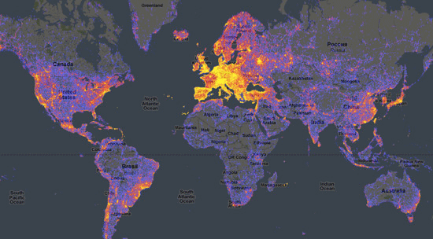

# Complex-Adaptive-Systems
Linhares Complex Adaptive Systems Course

OUTLINE

Objective:

Aluna doutorado:  "Qual é o papel do administrador?"

...the moment in History

Jogo de futebol: paralelismo maciço, cada variável influencia todas as outras, e a história de cada variável influencia o sistema

=======================================
Class 1: marblecake, also the game

1. Ant Trails

http://www.rennard.org/alife/english/antsgb.html

Ant trails:
	Where is the theory of process?

	Are there phase traditions?  When and where?

	What is work?  What is energy?

	What is temperature?

	What is emergent behavior?

	What are the different hierarchical viewpoints of the system?

	What are the qualitative behaviors at each hierarchical level?

2. Schelling's Models of Segregation

Berlin wall; Apartheid; NOT THIS

Rocinha; Germans versus Turkey;

Simulation at:
http://ccl.northwestern.edu/netlogo/models/Segregation

Schelling's segregation model:
	Where is the theory of process?

	Are there phase traditions?  When and where?

	What is work?  What is energy?

	What is temperature?

	What is emergent behavior?

	What are the different hierarchical viewpoints of the system?

	What are the qualitative behaviors at each hierarchical level?

3. Metacat

Priming is top-down pressure driven from bottom-up exploration

4. Nobody stops for a minute to ponder the enormity of the bullshit we're surrounded by

Example:  Price in economics, Inflation in economics

Example: Rankings

Example (for another class): Conferences about "the reasons of poverty"

Show RankingsWatch stuff.  

4. marblecake, also the game

=======================================
Change the perspective when reading papers:

Einstein's 4th dimension.

The most important scientific law.

	"The law that entropy increases holds the supreme position among the laws of nature.  
	If your theory is found to be against the 2nd law of thermodynamics I can give you no hope;
	there is nothing for it but to collapse in deepest humiliation.  

--Sir Arthur Eddington, The nature of the physical world.

	All states of the system are equally probable.  Only the lowest energy states in a cold system.

	Boltzmann's equation:  S = k log (W)

Networks → Cities, Countries, Economy, Corporations, the Brain, Biology, etc.

	Maxwell's demon.  It takes work (energy) to reduce entropy.

	A tese da Carla:  "A confusão no processo de escolha do consumidor".

	What is life?

	What is Wealth?

	Distribute some trillions around.


======================
Class #2

Phase transitions;

The "new normal"
Video youtube phase transition liquid nitrogen  

https://www.youtube.com/watch?v=p6mwDYlFf3s

It's ALWAYS a property of the system, not of the individuals.

Avalanche.
Copy Rickards model.

Do not mistake the bus that crashed the bridge with the fragility of the bridge.

Send "The black swan of Cairo" & "Here comes everybody" p/ todos.  

"networks & spreading of diseases".
Make keynote presentation
https://www.youtube.com/watch?v=L-dPxGLesE4

"Corporate control".  
Make keynote presentation
https://www.youtube.com/watch?v=NgbqXsA62Qs

The crisis: Bear Stearns & Lehman Brothers down (press) x ALL banks are zombies (me).  
http://demonocracy.info/infographics/usa/derivatives/bank_exposure.html

Group work:
Set up the groups
Task a (30 mins):  How can we discover a spreading of diseases before they strike the population?
Task a (15 mins):  Here is some new information...  How can you use it?
Present the two papers.
Find a Ranking
Get the data
Organize presentations of "Here comes everybody"

====
Risk management: Fukushima

Report(s) of geiger counters going nuts in Pennsylvania after heavy rains?
Environmental radiation data omitted on Q4 2011.  Did they forget or were they on vacation?  

http://epa.gov/radnet/radnet-data/erd.html

========================

	porcupine creek blixseth-->google images; 2 bentleys; maseratis, 150-feet yacht, 2 gulfstream V, castles in France

	Warren Buffett's attack on gold.

“[Gold] gets dug out of the ground in Africa, or someplace. Then we melt it down, dig another hole, bury it again and pay people to stand around guarding it. It has no utility. Anyone watching from Mars would be scratching their head.”

	Energy + Negentropy

	(Food calories, Human work, Electricity, Oil, etc.)

	(Ready to use resources, computer programs, new forms of organization like the assembly line, ideas, theorems, etc.)

	Zimbabwe money vs gold.

	Low-entropy states are weird, unsustainable, and scary

	"I will stay in London until one year BEFORE the war, then I'll move to America".

	& conflict--> http://www.youtube.com/watch?v=snGYMut3_xU&feature=youtu.be

	Complex adaptive systems: economy, neuroscience, ecology, ants, internet, social networks, etc.

	Economy as a complex adaptive system.  

	The crisis: Bear Stearns & Lehman Brothers down (press) x ALL banks are zombies (me).  
	http://www.zerohedge.com/news/mother-all-infographics-visualizing-americas-derivatives-universe
	http://demonocracy.info/infographics/usa/derivatives/bank_exposure.html

	There was a recession in the US but now a recovery is underway (press) x it's the illusion of printing money
	http://1.bp.blogspot.com/-rK0bjcI-pJ8/T3XNmUOB3fI/AAAAAAAAVLk/LGJDUrmnVEU/s640/MI-fed-stimulus-program-ending.gif

	Everybody thinks they have been robbed (Occupy, Greeks, Spainiards, Irish, etc).  They have been promised a bicycle by daddy, but daddy was lying.

For each paper, the Eliza effect:

suppose we change the variables in the system to \alpha_1, \alpha_2, \alpha_3, etc.  

===========
Scientific Entrepreneurship

"Knowledge is power"

Go do something important!

*Capitalism is implementing socialism*  

Capitalism ("Leave me alone", "Don't tread on me", "Individual responsibility", "I don't need, nor do I want, your help", "Equality of opportunity", "Role of govt == enforce contracts & fair playing field", "Chips fall where they may", "Low regulations & government distrust").  

Socialism ("You didn't build that", "Share the wealth", "The good of the collective", "The government is here to help", "Equality of outcome", "Role of govt == help the population from cradle to grave", "Inequality is unfair")

Somalia versus North Korea.

Wikipedia, Open-source, AirBnb, blogs, zipcar, uber, skype, etc.

Why?  Because people can take advantage (profit) from excess capacity.  

People can VOLUNTARILY share their excess capacity.  

Of course, the govt doesn't like it.  

So what are regulations really doing? (Protecting the status quo, "plus ça change, plus c'est la même chose", )

When one habitat contracts, another habitat expands.

What is probably expanding?  

1. Super-Open

Wikipedia (--> github wikipedia?); Open-Access Science, Open-Source code, Blogs, etc.
→Start an open scientific journal?  

2. Super-Closed, together with Super-Open.  

Bitcoin, Litecoin, Brogliato's app, cryptocat, etc.

3. Capitalism (voluntary) sharing (& spare capacities)

AirBnB, Uber, zipcar, etc.

Groupon →  November 2008!

Eric 

12/5/08

to me

dude, what's my password for the awesome new website?

On Fri, Dec 5, 2008 at 7:21 PM,  <linhares@mypromotionscentral.com> wrote:
> Hi Eric,
>
> You have a new account at My Promotions Central.
>
> Your username is eric. The administrator has set your password.
> Your new email address is eric@mypromotionscentral.com
>
> You can sign in to domain services at:
> Email - http://mail.mypromotionscentral.com
> Calendar - http://calendar.mypromotionscentral.com
> Chat - download Google Talk client from http://www.google.com/talk
>

Rangeit looks really cool.  There's also lastminute.com

But lastminute.com is UK-only (not worldwide, big mistake) AND NOT COPIED & PASTED all over the web, like youtube.  You have to go to their site, which means low adoption rates==lots of time for competitors to show up.

I'm back from honeymoon.  

I still think the idea has potential, but would be tricky to pull off.  All at once is hard to do.  

Getting airlines in would be hard (though we can use the power of the masses and let THEM send a canned email to companies, saying something like: "please do not waste capacity in these troubled times.  Fulfill your potential!!" Bah blah!  If users click on "American Airlines has not yet joined the program, click here to send them a personal message to make sure they fulfill their capacity and help save the world economy."  Maybe the masses would flood them in and they might respond...  Or maybe they'd sue us... but we're not spamming no one, your honor, we only want to save the world economy and make this nice company stop wasting money down the drain...

Now that I'm less crazily excited about the whole thing, here's what I think.  It has very large potential, in the hundreds of millions of bucks, if of course dozens of millions of people join up.  We also need the companies, but people may attract them if the numbers go large enough.  SO the only shot at this is to build it all in stealth mode, pray that no big name does the same thiing (it's just one idea whose time has come), and deliver the betas all in the same day.  I think it's "ebay-big".  

Do you think it's feasible to pull off a military strategy and develop the thing in stealth mode, N platforms, outsourcing some parts to India or elsewhere?  Let's say I get USD100k over here.  Seriously, what would you think?  --A.

4. Decentralization

Git, (github wikipedia?), bitcoin, p2p file-sharing, Git + torrent?

5. Synthesis of Intelligence   

* AI (or Bayesian) Intelligence  

* Decision Support Systems

→ Rankings Megacorp

*  Human-like intelligence

Revolutions & contextual ads.

VID → https://www.youtube.com/watch?v=0Y8-IzP01lw
Nicolas Perony: Puppies! Now that I've got your attention, complexity theory

============
What is complexity?

nobody knows.

But we know one thing.

COMPUTATIONAL COMPLEXITY

SImon's chess paper

http://www.optaplanner.org/blog/2013/08/06/FalseAssumptionsForVRP.html

History of computational complexity

Paper from EJOR.

I think this is a basic property of the universe.  (Seth Lloyd?)

Computational complexity of rankings
===========

3. The most basic law of all sciences

2nd law

4.1. What is work?  What is energy?

marblecake, also the game

=================================
3. Genetic Algorithms

Get Explanation

Use model from http://www.rennard.org/alife/english/gavgb.html

Genetic algorithms:
	Where is the theory of process?

	Are there phase traditions?  When and where?

	What is work?  What is energy?

	What is temperature?

	What is emergent behavior?

	What are the different hierarchical viewpoints of the system?

	What are the qualitative behaviors at each hierarchical level?

=====

Class 2: Axelrod's evolution of cooperation

Class 3: Axelrod's evolution of norms

Class 4: The garbage-can model

Class 5: The peter principle

Class 6: Hofstadter

Class 7: Kanerva 1

Class 8: Kanerva 2

==========

Class 9: Seminars 1

Class 10: Seminars 2

Bob French Marriage; Copycat and Metacat
